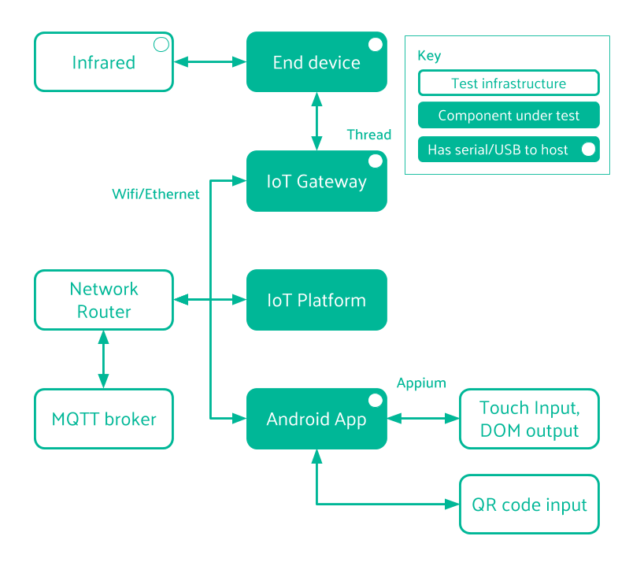

_This [article](https://zoetrope.io/tech-blog/end-to-end-iot-hardware-appium-testing/) was written during my time at [Zoetrope Labs](https://zoetrope.io/)._

Zoetrope labs has been involved in many IoT projects which lead to hardware ending up in end users homes and businesses. This poses a great challenge in that all hardware and software must not only work, but be resilient enough to deal with a wide range of customers usage patterns. Combined with the demand for speedy delivery of new features and the challenge only compounds.

With this in mind, Zoetrope labs has had a complete hardware-in-loop testing setup for some of the major projects we’ve been working on which allows all aspects of the software to be tested on real hardware. This helps us capture bugs which otherwise could easily be missed, especially those which are dependent on user input, or interaction with components outside of the system’s control.

_Note: By “hardware-in-loop” testing, we mean that the real units - e.g. IoT devices, wifi, phones etc are all used as parts of the tests. This is often called “[System testing](https://en.wikipedia.org/wiki/System_testing)”, however we don’t feel this quite captures how many different components are involved when applying this process to IoT systems._

The test suite we created for one recent project was a major task and we’re going to outline it in this post.

## The system under test

For this system, the main I/O from the end device is IR (which interacts with legacy appliances). This includes both receiving IR data (training data) and sending that data on command. This I/O could easily be anything else, such as switches, PLC’s or more complex and stateful hardware device such as doors, factory machinery etc. Aside from the IR interface, the system design is very standard:

## As a user, I should be able to…

The main function of the e2e testing is to ensure that the system is able to perform the actions that are required of it. Some examples of the kinds of test cases which were created are:

1. Creating a user account
2. Performing Wifi on-boarding of the IoT gateway
3. Thread on-boarding using QR scanning
4. Training the IR sensor with real IR input
5. Checking that the IoT device sends data when requested
6. Setting up schedules and other app functionality

## Appium, PyTest and a whole bunch of USB serial adapters

Due to the need to be able to factory reset hardware during and at the end of the tests we had 2 options - simulate button presses with relays or some other switching method soldered on to the target boards, or we could use builds of the software which had serial enabled (Shipped versions never have serial enabled!). We opted for using serial cables because this allowed us to accelerate the testing by being able to send `reset` commands to the target hardware and verify that this had happen. In other parts of the tests, serial output is used to assert correct output from system components to help debug when a larger component fails.

In an ideal world we of course would not have needed serial cables and we would have a mechanical means to physically actuate any user input. That’s not likely to happen for us soon due to the large time investment in making custom rigs for every device which we test.

The main system testing stack was built with:

1. Appium (1.6.5)
2. PyTest (with extensive use of fixtures for code reuse)
3. Pyserial
4. Docker (for running in CI)

## Appium

“[Appium is an open-source tool for automating native, mobile web, and hybrid applications on iOS, Android and Windows platforms](http://appium.io/docs/en/about-appium/intro/?lang=en)”. Appium is cross-platform so the same test code can be applied to both the iOS and Android versions of the React-Native app which itself uses the same JavaScript code for both (mostly!).

Appium abstracts the vendor-provided automation frameworks including Apple’s XCTest, Google’s UiAutomator, Google’s Instrumentation and Microsoft’s WinAppDriver are wrapped in a single API, known as the “WebDriver”, which is the same API used in Selenium, a popular tool for automated website testing.

Appium uses a Client/Server model, connected via the WebDriver API, where the client sends appropriate HTTP requests to the server in order to execute commands on the target device. The server will respond with the result of the command execution. This abstraction means that the client and tests can be written in any language with a HTTP client, clients are already available in many languages such as Python, Java, Perl, PHP and Ruby. We chose to use the [Python client](https://github.com/appium/python-client), matching the language of the IoT platform software. This has the added benefit that existing code such as PyTest fixtures can be implemented easily.

## Writing tests

We based our test code around this [Appium example project](https://github.com/casschin/appium-pytest), which uses the Python Appium client in combination with PyTest. The code consists of a `screen.py` file which contains useful helper functions such as `get_elements_by_type` which, when given a method of element identification (`xpath`, `accessibility_id`, `id`, `class_name`, `name`, `android` or `ios`) and corresponding value, returns the element you wish to interact with. A very helpful tool for identifying characteristics of the currently rendered DOM and it’s elements for Android is `UiAutomatorView` which comes with Android Studio. Each screen within the app has a Python class associated with it where all of the relevant element locators are defined, usually just the elements that a user can interact with e.g. buttons, scroll windows and text fields.

Appium commands are built up in to a sequence of functions acting across multiple screens of the target app with one or more assert statement that tests whether the app has behaved as expected. The assert statement can be as simple as asserting that an element is visible on the screen or that the text within the elements is equal to an expected value. A simple example test is registering a new user and ensuring that you can login to the app using the newly registered account.

Our longest and most complex test includes the whole user experience setting up the IoT system after unboxing and testing all of the major bits of product functionality. The setup process even involves scanning a QR code to identify the IoT Device to setup, therefore the camera on the Mobile Device is directed towards a print out of the relevant QR code. One piece of tested functionality is the ability to schedule times at which the AC power is turned on / off with a defined configuration, for example every Monday at 12:30pm turn on the AC at 16°C, on `Cool` mode with fan setting `High`, then turn off at 4:15pm. To test this an IR event is scheduled 2 minutes into the future from the time at which the new schedule is saved. The test then waits long enough to check if that action gets performed as expected. The IR Receiver is then sent a command to collect any IR data that it receives over a 5 second period. If the system is functioning correctly in all areas then the IoT Device should emit IR data at that time. An assert statement then checks whether the IR data received is correct, meaning that it would result in an real AC device being turned on with the desired configuration.

## Challenges

### Test repeatability

Naturally, an essential property of any test is repeatability, this is being able to run the same test multiple times on the same system and having the same outcome. To achieve this it was ensured that the state of the whole system was the same at the start and end of each class of PyTest tests. When the IoT Gateway and Devices are connected during the setup process this leaves them in a state in which another user of the mobile application cannot communicate with them. Resetting the IoT hardware to factory settings was done using a serial cable connected to the test machine or over SSH, this happens within the teardown phase of PyTest fixtures which can be applied to any test that requires it. The state of the database is also manipulated using fixtures, for example populating the database in the setup phase with relevant sensor data to be shown on the app graphs or reverting changes in the tear-down phase such as deleting a new user that was registered during the test.

### Time

Appium tests are usually faster than it would take to perform the tests manually however if many tests are created, to give a high level of coverage, then the execution time of a full test run can reach into the hours. This means that a test run on every new commit is not practical, so instead tests are run overnight, this can sometimes hinder development flow. The time spent during test execution includes the time it takes to perform actions, particularly sending keys into text fields, and waiting for the app to render the element that Appium is waiting for which increases with the response time of the Database Server.

### Platform specifics

Despite using React-Native in this case, there are many platform specific differences between iOS and android, for example in our React-Native app we use the native time pickers which have a very different appearance on the two platforms. This means that separate test code has to be used when interacting with these components. The Android time picker also happened to be very tricky to interact with via Appium as the movable minute hand of clock snaps to the nearest 5 minutes if the clock is tapped. A work around was to scroll from the nearest 5th minute to the desired minute, which rotates the minute hand during the scroll and stops without snapping.

Unfortunately, there are a great many other examples of these differences.

### React-Native

Facebook, who developed React-Native, use the `testId` property of the rendered views in their internal testing however this is not available in the current version of Appium (v1.6.5). The `reasourceId` can also not be set via React-Native (v49.0). Hence at the moment a work around for uniquely identifying elements is to use the `accessibilityLabel` which sets the `content-desc` property of the view. The disadvantage of using the `content-desc` property is that this is displayed to the user if they chose to do so from the accessibility settings, so the `content-desc` needs to be human readable and unique at least within each screen. At the time of putting together the E2E test system no accessibility labels were set in the app, so there was the tedious task of defining all of these for every element that was to be used in testing.

### Brittleness

Due to the fact that so many parts of the system are touched in every test, changes in any one of those components has the ability to break the tests, or require that more are created. Fixtures have helped us to mitigate many of the problems of this, since generally updating a fixture and a couple of tests is all that’s required.

## Conclusion

E2E testing complete IoT systems has identified compatibility issues and bugs before releases that our unit tests did not catch, particularly between the app and the server where the software is changing most rapidly. More importantly we have been able to ensure that all app functionality is tested very regularly, rather than the risk that only new or changed features are tested (rather than their knock-on effects).

Appium served as a very helpful, easy to use testing tool for automating user interaction with the IoT system, already saving precious days of manual testing time. The essentials of this test system should be able to port over to other similar IoT projects which use an Android or iOS app as it’s main user interface.
