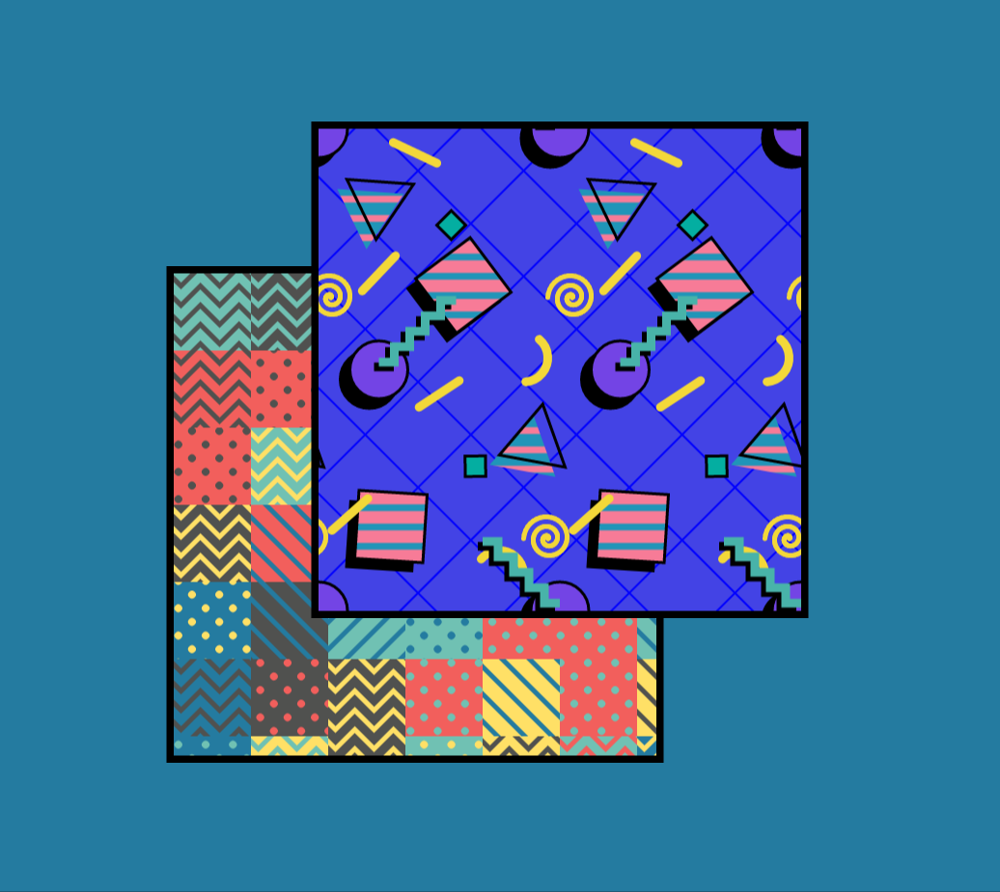
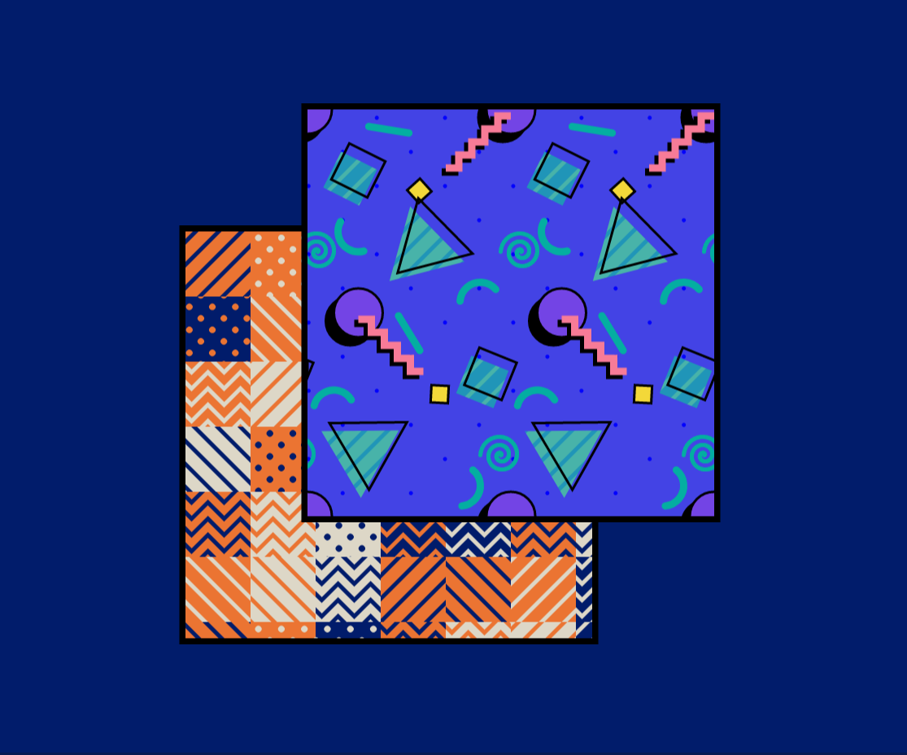
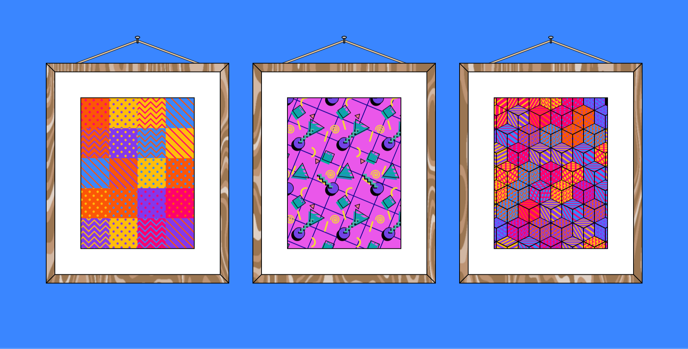
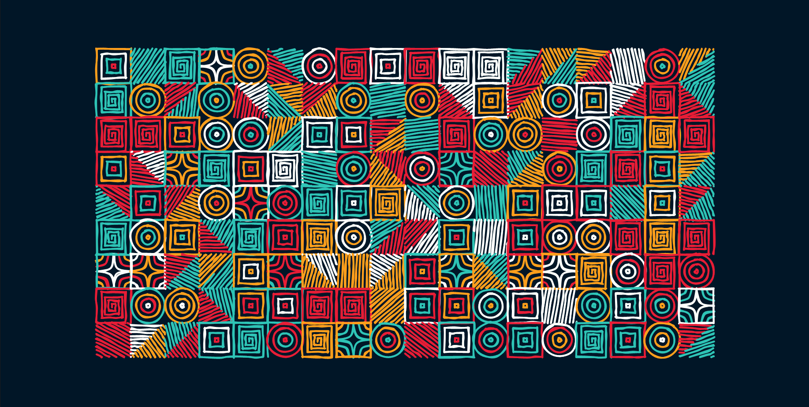
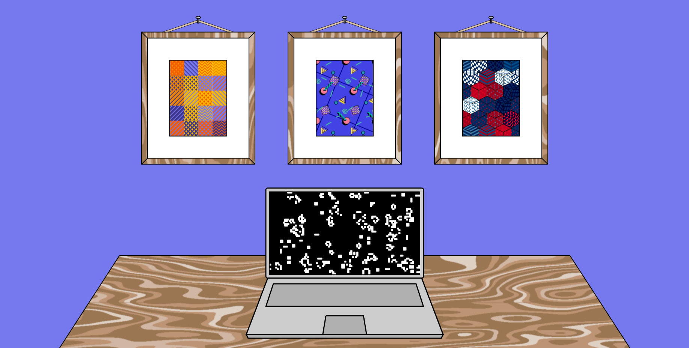

## Introduction
I have never really considered myself to be an "artistic person", I have never been able to draw or paint by hand with any accuracy. However, after discovering "digital generative art" and the various tools that allow coders to apply their skills in a creative medium, I found myself engrossed in writing scripts to generate artwork.

To caveat, I do not consider myself an expert in generative art, this article merely documents my brief dive into a vast domain full of talented devotees.

## Generative Art
The basic premise of generative art is that a coder provides instructions to the computer for what to draw on screen, these instructions include elements of randomness such that even the coder does not know what the end result will be. It is often the case that generative artists will run the same process multiple times and curate a collection of artworks that they deem to be successful and discard those which are less appealing. There is often skill in creating a script with enough randomness to generate new and interesting artworks, whilst also ensuring high quality.

A piece of generative art may be a single 2D or 3D image, a looping animation or even art which reacts external inputs such as [audio](https://p5js.org/examples/sound-mic-input.html). Some artists have even brought generative art into the real world by creating [sculptures](http://cmuems.com/2016/60212/lectures/lecture-09-16b/) designed using generative techniques.

## Processing
[Processing](https://processing.org/) has been one of the big players in the generative art world for decades now, it began as a Java based framework for creating art in 2001. Processing now has many other implementations such as [Processing Android](https://android.processing.org/) and [Processing Python](https://py.processing.org/). [P5.js](https://p5js.org/) is a JavaScript implementation that has become widely adopted in recent years, and is the library I used to experiment with generative art.

P5.js has two main functions you need to define, `setup` which gets called once at the start of your script to initialize your canvas and `draw` which gets called periodically in order to update the elements within your canvas. An element within your canvas might be a 2D shape such as a square or a circle, with attributes such as size, position and colour. Each of these attributes may be constant or vary indeterministically with each frame.

P5.js has many [third party libraries](https://p5js.org/libraries/) which add further functionality, some of which you will see in use below. Please refer to the official [P5.js docs](https://p5js.org/learn/) for more in depth learning materials.

## Examples
Below are a few examples of generative art I created using P5.js:

The pattern in the forward square was based on the [Memphis art style](https://en.wikipedia.org/wiki/Memphis_Group) popular in the late 80s and early 90s, which lends itself nicely to the 2D primitives available in P5.js.

This second image was generated using the exact same code however attributes such as the size, colour and position of shapes in the images have been modified.

In this example [Perlin noise](https://p5js.org/reference/#/p5/noise) was used to generate the wood grain effect on the wooden picture frames which will appear different every time the page is refreshed.

This example makes use of the [P5.scribble.js](https://github.com/generative-light/p5.scribble.js/) library which makes lines appear hand drawn.

Finally, this example replicates [Conway's Game of Life](https://p5js.org/examples/simulate-game-of-life.html) on the laptop screen and used code from a third party library, [p5.layers](https://github.com/osteele/p5.libs/tree/main/p5.layers), in order more to easily manage multiple layers of generative art in the same frame.

## NFTs
It wouldn't be an article about generative art without mentioning Non-Fungible-Tokens (NFTs). NFTs hit the Crypto world in a big way in 2021 where artwork hosted on the blockchain sold on applications such as [Art Blocks](https://www.artblocks.io/) for over [over a million US dollars](https://decrypt.co/79534/what-is-art-blocks-why-nfts-suddenly-selling-millions-ethereum).

NFTs aim to provide ownership over original pieces of digital artwork and increase the money which goes back to the artist. Unfortunately as with most things Crypto there is fair amount of risk and hype, so it is yet to be seen whether a sustainable eco-system will emerge around NFTs for digital artists.

## AI Generated Artwork
Another form of computer generated art is that which uses [AI or machine learning](https://aiartists.org/ai-generated-art-tools), there are [AI tools](https://hotpot.ai/art-maker) which allow creation based on text descriptions, so no coding knowledge required from the end user. There are many heating debates as to what impact AI will have on the future of art and the value of human artwork if it can be generated at the click of a button.

## Resources
[Perlin noise](https://en.wikipedia.org/wiki/Perlin_noise) is a fundamental technique in generate art for creating randomness that appears more organic than pure randomness (static) and takes the values of it's neighbours into account.

[Open Processing](https://openprocessing.org/) is a fantastic resource for existing P5.js projects that people have shared, where you can jump into their code from the in-built editor.

[The Coding Train](https://www.youtube.com/watch?v=yPWkPOfnGsw) is a very useful YouTube channel with many P5.js tutorials and covers many generative art concepts from beginners.

Other JavaScript libraries for creating generative art include [three.js](https://threejs.org/) and [Canvas-Sketch](https://github.com/mattdesl/canvas-sketch).

[Pinterest](https://www.pinterest.co.uk/search/pins/?q=generative%20art) was a great source of inspiration for surfacing existing artwork.

An [awesome list](https://github.com/kosmos/awesome-generative-art) for generative art.

## Conclusion
The current tools and resources available for creating generative art make it approachable even for absolute beginners. It could even be a good way to introduce someone to coding given the inherent fun that can be had generating art.
