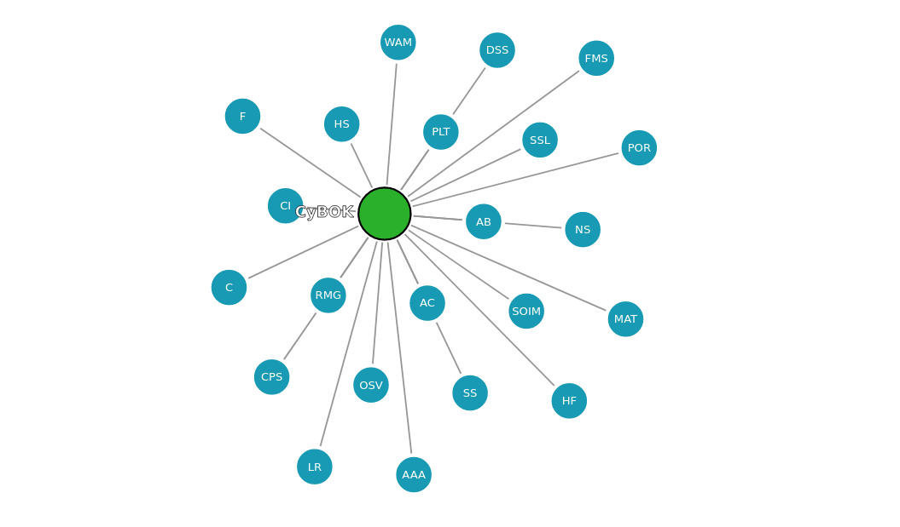
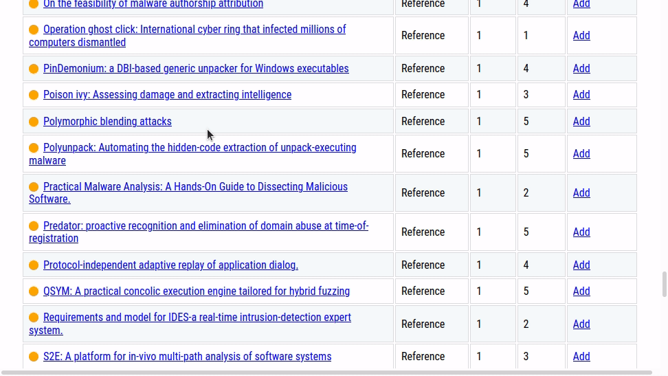
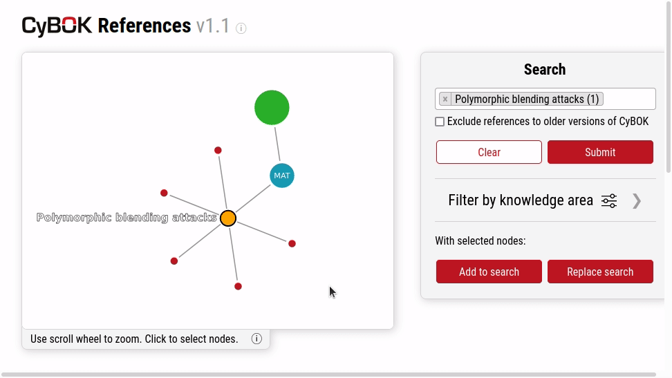
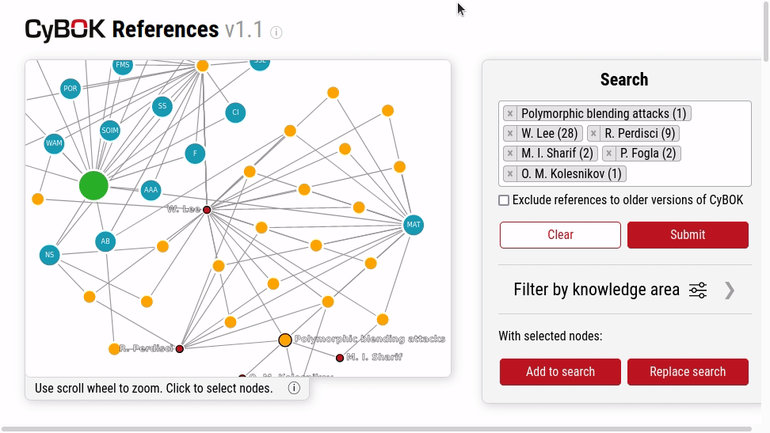
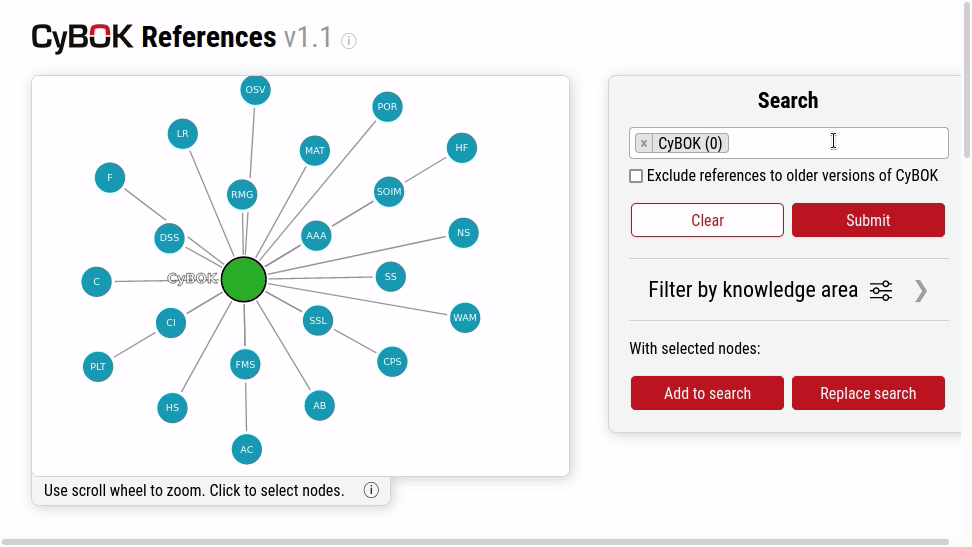
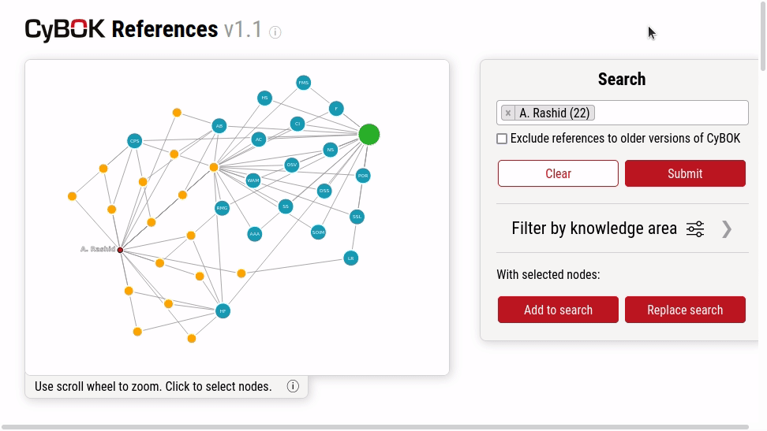
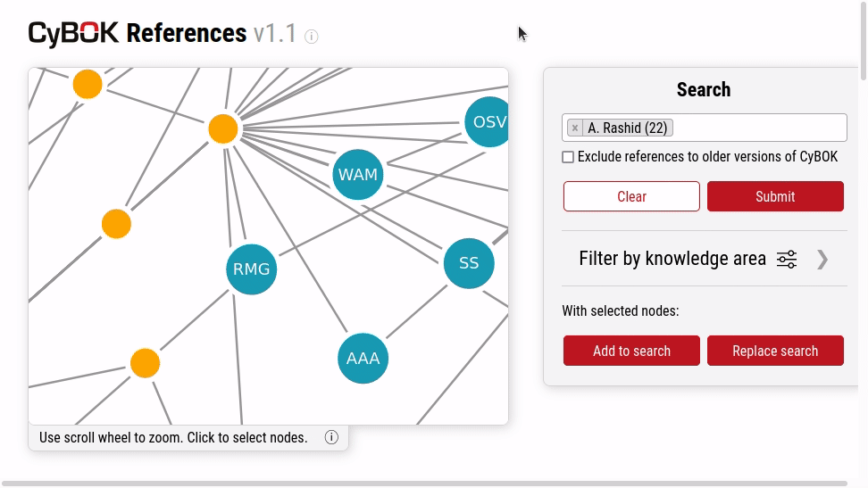

## Introduction

The [Cyber Security Body of Knowledge](https://www.cybok.org/knowledgebase1_1/) (CyBOK) is a "comprehensive body of knowledge to inform and underpin education and professional training for the cyber security sector", it aims to "bring cyber security into line with the more established sciences by distilling knowledge from major internationally-recognised experts". As a part of [Uncommon Correlation](https://www.uncommoncorrelation.co.uk/) we built an [interactive graph](https://cybok.uncommoncorrelation.co.uk/) of the all references within CyBOK.

CyBOK references roughly 2000 other resources, such as papers, books and websites, across 21 knowledge areas. Where nearly 5000 authors contributed to these references. Our goal was to make these references easier to search and explore, ultimately making this information more accessible to a wider audience.

## Guided Demonstration

I will take you through a guided demonstration to display the features of this application:

On arriving at the [interactive graph](https://cybok.uncommoncorrelation.co.uk/) you will be greeted by a force directed graph showing the relationships between the green CyBOK root node and the 21 blue knowledge area nodes.

By selecting one of these knowledge areas, such as '[Malware and Attack Technologies](https://cybok.uncommoncorrelation.co.uk/?id=CyBOK&id=Malware+and+Attack+Technologies)' and adding this as a search term you expose the 96 references within this knowledge area, which can also be seen in tabular form below.

Maybe the paper '[Polymorphic Blending Attacks](https://cybok.uncommoncorrelation.co.uk/?id=Polymorphic+blending+attacks)' catches your eye, you can click this item in the table to replace all current search terms with this one. This reveals the 5 authors that contributed to this paper.

Now you can ask some more interesting questions! Maybe you have read this paper and want to see what other papers these authors have written that have appeared CyBOK...

If you select all of these authors and add these to the search we can see there are many other references they have appeared in, as well as across 4 different knowledge areas.

### Side menu

If you are only interested in a subset of knowledge areas you can include or exclude knowledge areas using the 'Filter by Knowledge Area' side menu. Once you've selected the knowledge areas you're interested in you can hide away the side menu and continue with your exploration.

### Search bar

If there is a resource or author you already know the name of you can use the search bar, for example you could search for '[Rashid](https://cybok.uncommoncorrelation.co.uk/?id=A.+Rashid)', you'll see that as I type partial matches will appear in the dropdown underneath.

### Mobile Responsiveness

The styles of the web page have been made responsive such that it is still suitable for mobile devices. If you reduce the screen size the search box moves below the graph.

### Information modals

There are various 'i' icons where if clicked, they reveal a modal with information to help you with the functionality.

## Implementation

The way this was achieved was that CyBOK provided us with the bibliography files that we output by LaTeX. These files were then parsed with a Python script and a json file was outputted which describes each node and their connectedness to other nodes.

This json file is ingested by the D3 javascript graphing library in order to render the graph, where bespoke code was written to handle all of the elements you see on screen.

Given that the references for CyBOK version 1.1 will remain static, this allowed us to serve this project simply as static files, which reduces security risk given there is no database and authentication credentials.

## Limitations

If there are 2 authors with the same name they will be treated as the same node, and similarly 2 references with the same name will be treated as the same node.

Also, if the reference is to an older version of CyBOK, such as version 1.0, therefore self-referencing, we cannot yet show the underlying reference that version of CyBOK points to.

## Conclusion

We think this project should help both experienced academics and students find CyBOK resources they are looking for faster but also doing so in a way that doesn't involve a black-box recommendation algorithm. You can clearly visualise the steps you took to find your resources.
