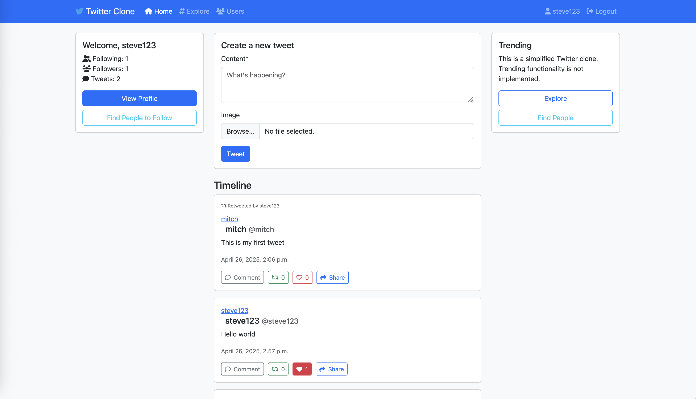

## Introduction

Early 2025 has seen a lot of "vibe coding" hype, tools like [Cursor](https://www.cursor.com/) and [Windsruf](https://windsurf.com/editor) have gained huge popularity, both of which are VSCode forks. These tools have gone beyond [Copliot](https://code.visualstudio.com/docs/copilot/overview)'s auto-complete, having an agentic AI which can plan and apply code changes to multiple files in multiple steps based on the users instructions in natural language. This saw an influx of developers moving to Cursor/Windsurf as their daily IDE, Microsoft's answer to this came on April 3rd 2025 when they announced [Copilot Agent mode](https://code.visualstudio.com/docs/copilot/chat/chat-agent-mode). At this point I had not done much "vibe coding" myself, as an exercise in becoming more familiar with these tools, I wanted to compare Copilot's new agent mode with Cursor by creating a Twitter clone from scratch using both tools.

## Copilot

I started by giving a fairly detailed initial prompt including that I wanted it to use Django and a docker compose setup with Postgres, and the main features that I wanted e.g. ability to follow other users by username, post/like/reshare a tweet and tweet feed. It started doing it's thing, generating the Django boilerplate code asking for confirmations along the way (you can set to auto-confirm if you want). It generated some fairly sensible looking database models. The views it made were function based so asked it to make them class based out of preference, something that could be added as a generic rule. The problem then came when trying to run the project... lots of configuration issues. Some issues were easy to fix with pre-existing knowledge of Django, other were not as obvious. Feeding the error messages into the chat went round in circles. After some frustration I decided it was actually going to be quicker to start a Django project from scratch using [django-cookiecutter](https://github.com/cookiecutter/cookiecutter-django) which got a running project with Django + Postgres + Docker Compose very quickly. A case where reaching for a deterministic tool was the better option.

Starting from a working base I asked it again to create the Twitter clone. Along the way I had to nudge it in a sensible direction. On trying to run it there was a runtime error. The feeling was very strange, my brain had entered a sort of idle/lazy mode whilst I was waiting for the output, the complete opposite of flow state, I didn't have a gut instinct for what was causing the error message because I hadn't written the code by hand. There was also a strange inertia to putting effort into figuring it out. The path of least resistance was to paste the error message in again, but the attempted solution didn't really solve the issue and effectively hid it by adding a try/catch. After a few more tweaks though... boom! The app was working!

This was a bit of a "WOW" moment. The app it created was relatively well styled and pretty much worked as intended with all the features I asked for. The process took about 1.5 hours, it probably would have taken me 6/7 hours to have done it by hand, a huge time saving.

## Cursor

I then performed the same exercise with Cursor, giving it the same initial prompt. Cursor managed to get a working Django application in one-shot, something Copilot failed at. The resultant application was also of better quality, particularly the styling.

I decided to spend some more time making the code base production ready with Cursor, asking it to add type annotations, logging, mypy, ruff, pre-commit, some tests with pytest and playwright etc. All of which it added with relative ease.

I also started expanding the feature set e.g. adding Celery and Redis for asynchronous tasks such as sending an email when a users tweet is retweeted. Also, adding [HTMX](https://htmx.org/) for interactivity rather than JS, for such things as infinite scrolling feed.

The resultant code base can be found [here](https://github.com/mitch104/twitter-clone). Overall I was impressed, although it didn't come without the downsides of obvious mistakes and self-inflicted rabbit holes. I spent roughly 10 hours on the project, something that could have taken 80 hours to have done manually. Generally I found Cursor to make fewer mistakes even though both were using the same underlying LLM model of Claude 3.7.

## Conclusion

These agentic AI code editors are well known for being very good at prototyping and MVP creation, where the code quality is not the highest priority. Working in a large scale production code bases is a different story. It could become an automated tech debt generator if left to it's own devices. It's ultimately a trade off, you are prioritising speed over code quality and ability to debug when something goes wrong. Sometimes this will be the right trade off to make, sometimes it won't be. As software engineers we'll need to maintain the skills to do it manually when needed and not let those skills deteriorate.

Over the next few months we'll see lots of best practices emerge for using these tools which will hopefully avoid some of the most egregious mistakes.

It seems like Cursor is on the cutting edge of coding agents whereas Microsoft are still playing catch up with Copilot agent mode. JetBrains has now also entered the race by releasing a [coding agent](https://blog.jetbrains.com/blog/2025/04/16/jetbrains-ides-go-ai/), which will allow JetBrains users to stick to their preferred IDE.
